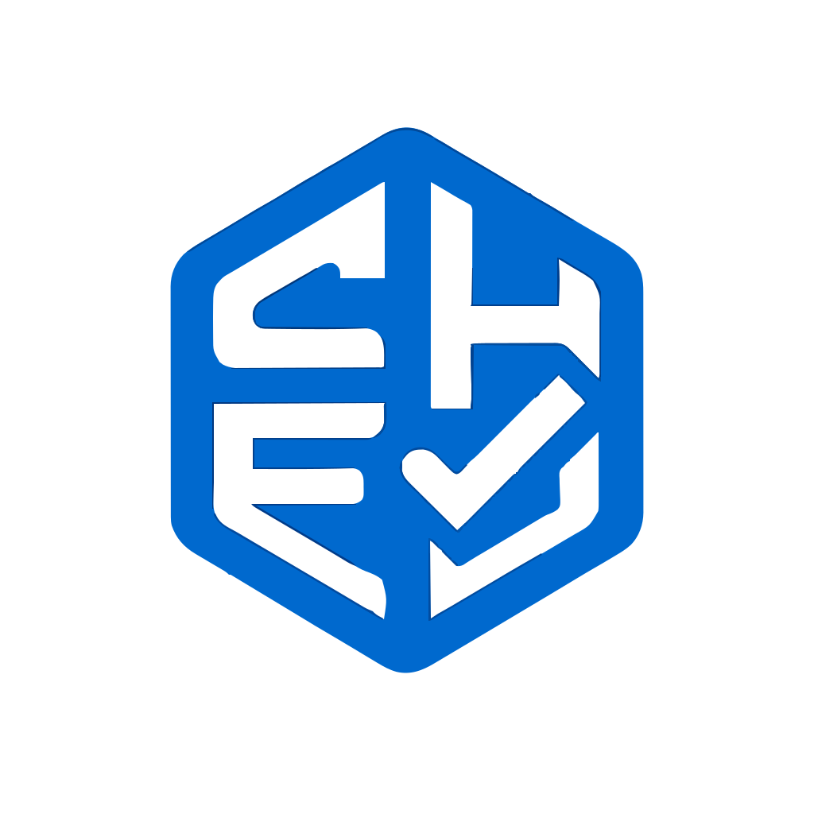

<div align="center">
  
  <h1 align="center">SHEIQpro</h1>
</div>

<p align="center">
  <strong>Your comprehensive solution for Safety, Health, Environment, and Quality (SHEQ) management.</strong>
</p>
<p align="center">
    <a href="#about-the-project">About</a> •
    <a href="#features">Features</a> •
    <a href="#tech-stack">Tech Stack</a> •
    <a href="#getting-started">Getting Started</a> •
    <a href="#contributing">Contributing</a> •
    <a href="#license">License</a> •
    <a href="#contact">Contact</a>
</p>
<hr>

## <a name="about-the-project"></a>About The Project

SHEIQpro is a comprehensive, AI-powered web application designed to streamline and enhance Safety, Health, Environment, and Quality (SHEQ) management processes. This platform provides a suite of tools to help organizations maintain compliance, manage risks, and foster a culture of safety and quality.

From contractor safety management and risk assessments to health monitoring and emergency preparedness, SHEIQpro offers a centralized solution for all your SHEQ needs. The integration of AI-powered features provides intelligent recommendations and automates complex tasks, enabling proactive and data-driven decision-making.

## <a name="features"></a>Features

SHEIQpro comes packed with a wide range of features to cover all aspects of SHEQ management:

*   **AI-Powered Recommendations:** Get intelligent suggestions for risk assessments, KPI improvements, and more.
*   **Checklist Templates:** Create and manage checklist templates for inspections and audits.
*   **Contractor Safety Management:** Onboard, manage, and monitor contractor safety compliance.
*   **Interactive Dashboards:** Visualize key SHEQ metrics and track performance with interactive charts and graphs.
*   **Data Visualization:** Analyze incident data and other SHEQ metrics to identify trends and insights.
*   **Emergency Preparedness:** Develop and manage emergency plans, resources, and mock drills.
*   **Health Monitoring:** Track employee health, manage medical tests, and oversee wellness programs.
*   **PPE Management:** Manage Personal Protective Equipment (PPE) inventory, issuance, and inspections.
*   **Risk Management:** Identify hazards, assess risks, and maintain a comprehensive risk register.
*   **SHE Meetings:** Schedule, conduct, and track Safety, Health, and Environment (SHE) meetings.
*   **SHEQ Audits:** Plan, schedule, and execute comprehensive SHEQ audits.
*   **Training & Competence:** Manage employee training programs, track competence, and maintain training records.
*   **User Management:** Control access and permissions with a role-based user management system.

## <a name="tech-stack"></a>Tech Stack

This project is built with a modern technology stack:

*   **[Next.js](https://nextjs.org/):** A React framework for building server-side rendered and static web applications.
*   **[React](https://reactjs.org/):** A JavaScript library for building user interfaces.
*   **[TypeScript](https://www.typescriptlang.org/):** A typed superset of JavaScript that compiles to plain JavaScript.
*   **[Tailwind CSS](https://tailwindcss.com/):** A utility-first CSS framework for rapid UI development.
*   **[Firebase](https://firebase.google.com/):** A platform for building web and mobile applications, used for authentication, database, and hosting.
*   **[Genkit](https://firebase.google.com/docs/genkit):** A framework for building AI-powered features.
*   **[Stripe](https://stripe.com/):** A payment processing platform for handling subscriptions and payments.
*   **[Shadcn/ui](https://ui.shadcn.com/):** A collection of re-usable components built using Radix UI and Tailwind CSS.

## <a name="getting-started"></a>Getting Started

To get a local copy up and running, follow these simple steps.

### Prerequisites

Make sure you have the following software installed on your machine:

*   [Node.js](https://nodejs.org/en/) (v20 or later)
*   [npm](https://www.npmjs.com/get-npm) or [yarn](https://classic.yarnpkg.com/en/docs/install/)
*   [Firebase CLI](https://firebase.google.com/docs/cli#install_the_cli)

### Installation

1.  **Clone the repository:**
    ```sh
    git clone https://github.com/your-username/sheiqpro.git
    cd sheiqpro
    ```

2.  **Install NPM packages:**
    ```sh
    npm install
    ```

### Environment Configuration

1.  **Create a Firebase project:**
    *   Go to the [Firebase Console](https://console.firebase.google.com/) and create a new project.
    *   Enable the following services:
        *   Authentication (with desired providers)
        *   Firestore Database
        *   Storage
    *   Register a new web app and copy the Firebase configuration object.

2.  **Create a `.env.local` file:**
    *   In the root of the project, create a file named `.env.local`.
    *   Add the following environment variables to the file, replacing the placeholder values with your Firebase project's configuration:
    ```env
    NEXT_PUBLIC_FIREBASE_API_KEY="your-api-key"
    NEXT_PUBLIC_FIREBASE_AUTH_DOMAIN="your-auth-domain"
    NEXT_PUBLIC_FIREBASE_PROJECT_ID="your-project-id"
    NEXT_PUBLIC_FIREBASE_STORAGE_BUCKET="your-storage-bucket"
    NEXT_PUBLIC_FIREBASE_MESSAGING_SENDER_ID="your-messaging-sender-id"
    NEXT_PUBLIC_FIREBASE_APP_ID="your-app-id"
    ```

3.  **Set up Stripe (Optional):**
    *   If you want to use the payment features, you'll need to create a [Stripe](https://stripe.com/) account and add your API keys to the `.env.local` file.

### Running the Application

1.  **Run the development server:**
    ```sh
    npm run dev
    ```

2.  Open [http://localhost:9002](http://localhost:9002) with your browser to see the result.

## Project Structure

The project follows a standard Next.js project structure, with some additional directories for our specific needs:

```
/
├── public/           # Static assets
├── src/
│   ├── app/          # Next.js App Router, contains all pages and layouts
│   ├── components/   # Reusable UI components
│   ├── ai/           # AI-related code, including Genkit flows
│   ├── lib/          # Helper functions and utilities
│   ├── contexts/     # React contexts for state management
│   ├── hooks/        # Custom React hooks
│   └── ...
├── .env.local        # Environment variables (untracked)
├── next.config.ts    # Next.js configuration
└── package.json      # Project dependencies and scripts
```

## <a name="ai-features"></a>AI Features

SHEIQpro leverages the power of AI to provide intelligent features and automate complex tasks. These features are built using **Genkit**, a framework for building AI-powered applications.

Here are some of the key AI features available in SHEIQpro:

*   **Analyze Audit Data:** Automatically analyzes audit data to identify trends, non-conformities, and areas for improvement.
*   **Generate Drill Scenarios:** Creates realistic emergency drill scenarios to test and improve your emergency preparedness plans.
*   **Generate KPI Recommendations:** Suggests relevant Key Performance Indicators (KPIs) based on your organization's goals and industry best practices.
*   **Generate Legal Registers:** Helps you create and maintain a comprehensive legal register to ensure compliance with relevant regulations.
*   **Suggest Risk Assessments:** Provides suggestions for risk assessments based on identified hazards and operational context.
*   **Generate Safety Recommendations:** Offers actionable safety recommendations to mitigate identified risks.
*   **Generate SHE Reports:** Automates the generation of comprehensive Safety, Health, and Environment (SHE) reports.
*   **Identify Hazards:** Automatically identifies potential hazards from text descriptions of work activities.
*   **Send Action Item Reminders:** Sends intelligent reminders for overdue action items.
*   **Suggest Root Causes:** Helps you identify the root causes of incidents and non-conformities.
*   **Vet Contractors:** Assists in the contractor vetting process by analyzing their safety performance and documentation.

## <a name="contributing"></a>Contributing

Contributions are what make the open-source community such an amazing place to learn, inspire, and create. Any contributions you make are **greatly appreciated**.

If you have a suggestion that would make this better, please fork the repo and create a pull request. You can also simply open an issue with the tag "enhancement".

1.  **Fork the Project**
2.  **Create your Feature Branch** (`git checkout -b feature/AmazingFeature`)
3.  **Commit your Changes** (`git commit -m 'Add some AmazingFeature'`)
4.  **Push to the Branch** (`git push origin feature/AmazingFeature`)
5.  **Open a Pull Request**

## <a name="license"></a>License

Distributed under the MIT License. See `LICENSE` for more information.

## <a name="contact"></a>Contact

Project Link: [https://github.com/your-username/sheiqpro](https://github.com/your-username/sheiqpro)
